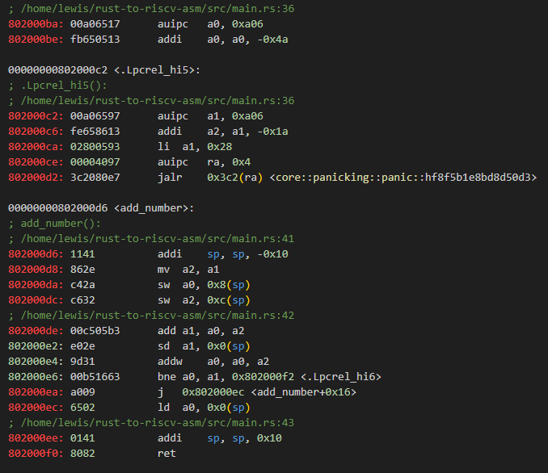
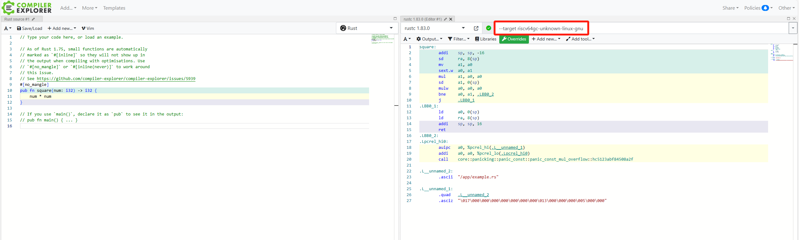

# rust-to-riscv-asm
A bare metal program example about how to convert rust code to RISC-V assembly.

## Get started

### Generate assembly
Only need install rust toolchain
```shell
# build the project
make build
# output asm to a file
make asm > output
```


### Run example on qemu
Need install qemu
```shell
# Unbuntu
sudo apt install qemu-system-riscv64
# MacOS
brew install qemu
```

Run
```shell
make run
```
output
```
Hello, world!
inited heap: [0x80c09000, 0xc0c09000)
1 + 2 = 3
```

## Another way: Compiler Explorer site
1.Open site: https://rust.godbolt.org/

2.Add `--target riscv64gc-unknown-linux-gnu` to compiler options
